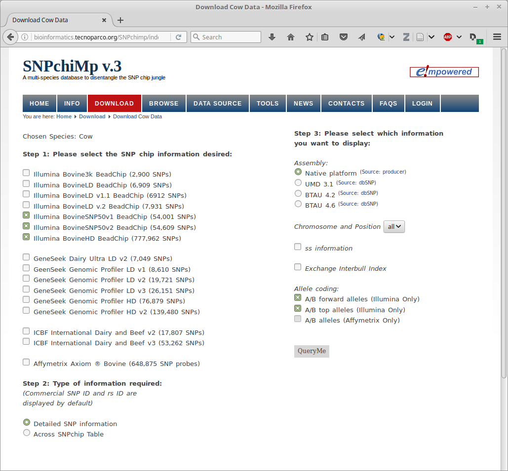

```{r setup, include=FALSE}
knitr::opts_chunk$set(echo = TRUE)
library(data.table)
library(ggplot2)
library(DT)
```

# Getting the data

The original data regarding flanking sequences, assembly and Illumina's inferred position can be found at:

* [BovineSNP50 v1.0](http://support.illumina.com/downloads/bovinesnp50_v10_product_files.html)
* [BovineSNP50 v2.0](http://support.illumina.com/downloads/bovinesnp50v2.html)
* [BovineHD](http://support.illumina.com/downloads/bovinehd.html) 

The NCBI dbSNP database https://www.ncbi.nlm.nih.gov/projects/SNP/ contains the same SNPs, but due to different assemblies and/or [mapping procedures](https://www.ncbi.nlm.nih.gov/books/NBK21088/#ch5.ch5_s8)  the positions are different.

The SNPSNPchiMp database contains both sets of information:

* [Nicolazzi et al 2014. SNPchiMp: a database to disentangle the SNPchip jungle in bovine livestock](http://bmcgenomics.biomedcentral.com/articles/10.1186/1471-2164-15-123)
* [Nicolazzi et al 2014. SNPchiMp v.2: An Open Access Web Tool for SNP Data Management on Bovine, Porcine and Equine Livestock](https://asas.org/docs/default-source/wcgalp-proceedings-oral/157_paper_9057_manuscript_406_0.pdf?sfvrsn=2)
* [Nicolazzi et al 2015. SNPchiMp v.3: integrating and standardizing single nucleotide polymorphism data for livestock species. ](http://bmcgenomics.biomedcentral.com/articles/10.1186/s12864-015-1497-1)]
* [SNPchiMp website](http://bioinformatics.tecnoparco.org/SNPchimp/)

Data for the Illumina chips 50Kv1, 50Kv2 and 777K was retriewed from  http://bioinformatics.tecnoparco.org/SNPchimp/index.php/download/download-cow-data (see figure). Positions from both Illumina (assembly: "Native platform") and dbSNP (assembly: "UMD3.1") was downloaded as gzipped tab-separated files.



# Comparing Native and UMD3.1 positions

First we read in and combine the positions for native and UMD3.1.

```{r read_chips, warning=F, message=F, cache=T}
#read in SNPchimp data with positions from chip provider (assembly: Native platform)
#and from dbSNP (assembly: UMD3.1)
nat <- fread('zcat illumina_50Kv1_50Kv2_777K_native.tsv.gz',showProgress=F)
umd <- fread('zcat illumina_50Kv1_50Kv2_777K_UMD3.1.tsv.gz')
both <- merge(nat,umd,by=c('chip_name','SNP_name'))[,.(chip_name,SNP_name,chr.nat=chromosome.x,pos.nat=position.x,chr.umd=chromosome.y,pos.umd=position.y)]
```

Counting cases where the position differes between Native and UMD3.1 we find that:

* Almost every position differs for the Illumina 50Kv1 chip, indicating different assemblies.
* For the 50Kv2 and 777K chips only a few percent of the SNPs differ, indicating the same assembly.

```{r compare_positions_1}
#For Illumina 50Kv1 the native position do not match UMD3.1 at all, 
#For the other two chips only a small  number of SNPs between Native and UMD3.1
both <- both[,N_snps:=.N,by=chip_name]
print('Table: Number of SNPs per chip (N_snps), and number of SNPs where the Native platform position differ from dbSNP UMD3.1 position (N_diff)"')
both[pos.nat!=pos.umd,.(`N_diffpos`=.N),by=c('chip_name','N_snps')]
```

Looking at the 53099 SNPs that are both on the 50Kv2 and 777K chips they all have the same position for the same assembly.

```{r compare_positions_2}
#Compare positions of SNPs with same name in Illumina 50Kv2 and 777K
#all SNP with same name have same position for same assembly
snpchimp <- rbind(cbind(nat,assembly='Native'),cbind(umd,assembly='UMD3.1'))
pos_per_name <- snpchimp[chip_name!='Bov_Illu50Kv1',.(positions=length(unique(position)),chips_with_snp=.N),,by=c('SNP_name','assembly')]
pos_per_name[,.N,by=c('assembly','positions','chips_with_snp')]
```

Looking at the differences in position we see that the main changes are for unplaced SNPs (chr 0 in the figures below).
Many SNPs are unplaced by Illumina but placed on chromosomes by dbSNP and vice versa. A few SNP are also moved from one chromsome to another chromosome. 

```{r plot_positions}
both[chr.nat!=chr.umd][,.N,by=chip_name]
both[chr.nat==chr.umd&pos.nat!=pos.umd][,.N,by=chip_name]
both[chr.umd=='99']$chr.umd<-'0'
p <- ggplot(both[chr.nat!=chr.umd,.N,by=c('chr.nat','chr.umd','chip_name')]) + geom_point(aes(x=chr.nat,y=chr.umd,size=N))
p <- p + ggtitle('SNPs where snpchimp chromosome differ \n between Native and UMD3.1 assembly') + labs(x='Native chromosome',y='UMD3.1 chromsome')
p + facet_wrap(~chip_name,nrow=2) + theme(legend.justification=c(1,0), legend.position=c(1,0))
```

# SNPs that might need flipping of alleles

The ANPchimp data also give an easy way to identify the SNPs that will be flipped if the wrong allel-coding is used during file conversion.

```{r flip_alleles}
umd[,flip:=Alleles_A_B_FORWARD!=Alleles_A_B_TOP,by=SNP_name]
umd[,.N,by=c('chip_name','flip')]

```

# Summary / TODOs

* For consistent positions across all three chips we should use dbSNP positions.
* TODO: Check which positions have been used for converting Illumina files
* TODO: Compare Tims list of SNPs to be flipped with this data
* TODO: Compare Tims remapped positions with the dbSNP positions


